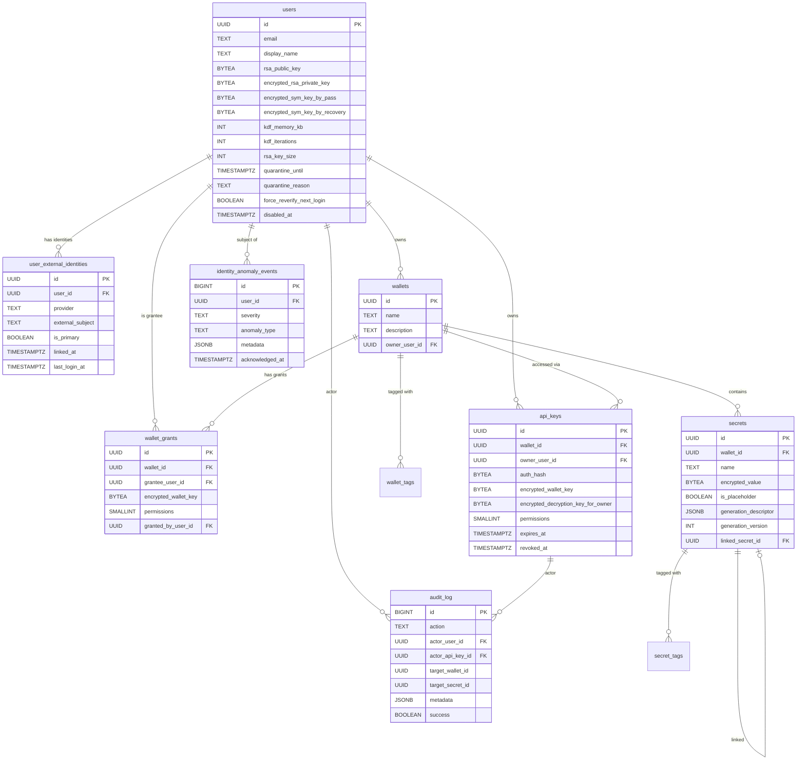

# Harpocrate — Document de cadrage

> **Lecture obligatoire avant tout lot.** Ce document fixe les décisions transverses, les conventions, et le vocabulaire partagé.
>
> Harpocrate (Ἁρποκράτης) est le dieu grec du silence et du secret. Le projet porte ce nom pour refléter son rôle : un coffre où les secrets restent silencieux, même pour ceux qui hébergent l'application.

## 1. Vision produit

`Harpocrate` est un **gestionnaire de secrets E2E (end-to-end encrypted)** qui permet à des utilisateurs humains et à des automates (agents Docker, pipelines CI, scripts d'installation) de stocker, partager et consommer des secrets (API keys, mots de passe, certificats, clés SSH, etc.) avec une garantie cryptographique forte : **le serveur ne voit jamais les valeurs en clair**.

### Cas d'usage principaux

1. **Stockage de credentials d'agents** : un agent Docker pull son `ANTHROPIC_API_KEY` au démarrage via une API key scopée à un wallet.
2. **Bootstrap d'environnement Swarm** : `install.sh` reçoit une API key, lit un wallet "template" préparé dans l'UI, génère localement les secrets manquants et les pousse dans Docker Swarm.
3. **Partage de secrets entre humains** : un développeur partage un wallet avec un collègue avec des permissions précises.
4. **Promotion entre environnements** : exporter la structure d'un wallet dev → uat → prod (sans valeurs).

### Ce que ce produit n'est pas

- Pas un PKI complet (pas de signing CA hiérarchique au MVP)
- Pas un gestionnaire d'identités (les providers OAuth font ce job)
- Pas un secret manager d'infrastructure type Hashicorp Vault avec leasing dynamique, transit engine, etc.
- Pas un outil de partage de compte (un compte = un humain ; pour partager, on utilise les `wallet_grants`)

## 2. Principes architecturaux

### Cinq principes non-négociables

1. **End-to-end encryption** : les valeurs des secrets ne sont jamais en clair côté serveur. Toute la cryptographie effective est faite par le client (UI navigateur ou SDK).
2. **Zero-knowledge admin** : un administrateur système avec accès à la base de données et aux logs ne peut pas lire les secrets.
3. **Identité externe stable** : Harpocrate s'identifie par le `sub` du provider OAuth fédéré (typiquement Google), pas par celui de Keycloak. Cela permet de réinstaller Keycloak ou de changer d'IDP sans perdre l'accès aux secrets.
4. **Séparation stricte humain / machine** : les API keys (auth machine) ont un périmètre fonctionnel restreint. La gouvernance (création de wallets, gestion des grants, transferts) est réservée aux humains JWT.
5. **Pas de SQLAlchemy, pas d'Alembic** : asyncpg direct avec SQL en clair, migrations versionnées sous forme de fichiers `.sql` dans `migrations/`.

### Stack technique imposée

| Couche | Choix |
|---|---|
| Backend HTTP | FastAPI (Python 3.12+) |
| Validation | Pydantic v2 |
| DB | PostgreSQL 16+ |
| Driver DB | asyncpg (direct, pas d'ORM) |
| Logging | structlog en JSON |
| Auth | OIDC via Keycloak (broker vers Google), avec identité Google fédérée |
| Frontend | React + Mantine + Zustand + Zod + React Router |
| Crypto navigateur | `window.crypto.subtle` + `argon2-browser` (WASM) |
| Crypto Python | `cryptography` (PyCA) + `argon2-cffi` |
| Backup chiffrement | `age` (clé admin gérée hors-serveur) |
| Backup distant | S3 v4 standard (R2, B2, MinIO, etc.) |
| Containerisation | Docker, déploiement Swarm |
| Tunnel public | Cloudflare Tunnel (yoops.org) |

### Contraintes de code

- **Aucun fichier > 300 lignes**. Si un fichier dépasse, le scinder.
- **TypeScript strict** côté frontend.
- **Type hints obligatoires** côté Python, validés par mypy en strict mode.
- **structlog JSON** : pas de print, pas de logging.basicConfig en prod.
- **Aucune valeur sensible loggée** : ni passphrases, ni secrets en clair, ni tokens, ni body des endpoints `/secrets`.

## 3. Modèle cryptographique

### Vue d'ensemble

```
PASSPHRASE UTILISATEUR (humain, jamais transmise)
    │
    │ Argon2id(passphrase, salt_pass)
    ▼
PASS_KEY (256 bits, en RAM client uniquement)
    │
    │ AES-256-GCM(rsa_priv, pass_key) → blob serveur
    │ AES-256-GCM(sym_key, pass_key) → blob serveur
    ▼
RSA_PRIV + SYM_KEY (déchiffrées en RAM client à l'unlock)

WALLET_KEY (256 bits, par wallet, générée côté client)
    │
    │ RSA-OAEP(wallet_key, rsa_pub_user) → wallet_grants.encrypted_wallet_key
    ▼
DESTINATAIRES (chaque grantee a sa copie chiffrée)

SECRET_VALUE (texte clair côté client uniquement)
    │
    │ AES-256-GCM(value, wallet_key) → secrets.encrypted_value
    ▼
VALEUR CHIFFRÉE EN BASE
```

### Recovery

```
SEED RECOVERY (32 bytes random, encodés BIP-39 24 mots, donnés à l'humain)
    │
    │ Argon2id(seed, salt_recovery)
    ▼
RECOVERY_KEY
    │
    │ AES-256-GCM(sym_key, recovery_key) → blob serveur
    ▼
SYM_KEY (récupérable si la passphrase est perdue)
```

### API keys (vrai E2E machine)

```
TOKEN: hrp_<v>_<id>_<exp>_<perms>_<auth_secret>_<decryption_key>_<hmac>
                                       │             │
                                       │             └── jamais envoyé serveur, RAM SDK
                                       └── envoyé serveur (vérification Argon2id)

WALLET_KEY chiffrée par decryption_key → api_keys.encrypted_wallet_key
                       │
                       │ Le serveur ne possède PAS decryption_key,
                       │ donc ne peut pas déchiffrer encrypted_wallet_key.
                       ▼
SDK CLIENT déchiffre wallet_key, puis encrypted_value
```

### Paramètres cryptographiques (floors)

| Paramètre | Floor (min) | Défaut | Configurable |
|---|---|---|---|
| Argon2id memory | 65536 KB (64 MB) | 65536 | ↑ uniquement |
| Argon2id iterations | 3 | 3 | ↑ uniquement |
| Argon2id parallelism | 4 | 4 | ↑ uniquement |
| RSA key size | 2048 | 2048 | 2048 ou 4096 |
| Passphrase length | 12 | 12 | ↑ uniquement |
| Recovery words (BIP-39) | 24 | 24 | 12 ou 24 |
| Salt size | 16 bytes | 16 | fixe |

Le serveur **rejette au démarrage** toute config qui descend en dessous des floors.

### Algorithmes utilisés

| Usage | Algorithme |
|---|---|
| KDF passphrase / recovery | **Argon2id** (RFC 9106) |
| Chiffrement symétrique | **AES-256-GCM** (NIST SP 800-38D) |
| Chiffrement asymétrique | **RSA-2048/4096 OAEP** avec SHA-256 (PKCS#1 v2.2) |
| HMAC tokens API key | **HMAC-SHA256** tronqué à 128 bits |
| Hash mot de passe API key | **Argon2id** (mêmes floors) |
| Encodage tokens | **base64url** (URL-safe, sans padding) |
| Recovery phrase | **BIP-39** 24 mots (256 bits d'entropie) |
| Backup chiffrement | **age** (clé admin) |

### Le serveur ne voit JAMAIS

- Passphrase utilisateur
- Recovery seed / mots BIP-39
- Pass_key, recovery_key, sym_key, rsa_priv (versions en clair)
- Wallet_key (en clair)
- Valeur en clair d'un secret
- Decryption_key d'API key (jamais transmise par le SDK)
- Clé privée `age` admin (utilisée pour déchiffrer les backups)

### Le serveur voit en clair

- Email, display_name (attributs mutables)
- `external_subject` (identifiant stable du compte fédéré)
- RSA pub key utilisateur (publique par nature)
- Nom et description des wallets
- Nom, description, tags des secrets
- Generation_descriptor des secrets
- Auth_secret d'API key (à la création, mais stocké hashé)
- HMAC key serveur (env var, sensible)
- Audit logs
- Clé `age` publique de l'admin (pour chiffrer les backups)

## 4. Modèle d'identité

### Principe : identité externe stable

Harpocrate ne stocke pas le `sub` Keycloak (qui change si Keycloak est réinstallé), mais le **`sub` du provider OAuth fédéré** (Google, GitHub, etc.) qui est stable à vie.

Keycloak agit comme un **broker OIDC** vers les providers réels. Sa fonction : router l'authentification, normaliser les claims, gérer les refresh tokens. Mais l'identité durable d'un user vient du provider derrière.

### Multi-identité par utilisateur

Un user Harpocrate peut lier **plusieurs identités OAuth** (cas A : compte personnel multi-comptes). Toutes pointent sur le même `user_id` interne, donc partagent la même passphrase, RSA keypair, sym_key et donc les mêmes secrets.

```mermaid
flowchart LR
    G1[gael@yoops.org<br/>Google sub: 1234] --> U
    G2[gael.pro@harpocrate.io<br/>Google sub: 5678] --> U
    GH[gael GitHub<br/>sub: 9012] --> U
    U[user_id: abc-123<br/>une seule passphrase<br/>une seule sym_key]
```

**Refus explicite des comptes partagés** (cas B : un compte pour plusieurs humains). Pour le partage entre humains, le mécanisme `wallet_grants` est la seule réponse correcte.

### Détection d'anomalies au login

À chaque login, le serveur compare les claims du JWT avec l'état stocké pour détecter des changements suspects :
- `info` : email mineur changé → mise à jour silencieuse + audit
- `warning` : display_name changé significativement, inactivité longue → bandeau UI au login
- `critical` : email_verified=false, ou autre signal fort → blocage du login, exiger validation admin ou recovery phrase

### Quarantaine après inactivité

Si un compte n'a pas été utilisé depuis plus de N jours (défaut 90), le login déclenche une **quarantaine** : l'user a accès en lecture seule pendant M jours (défaut 14). Sortie via :
- Validation par recovery phrase (côté user)
- Approbation admin manuelle
- Expiration naturelle après M jours (configurable)

Pendant la quarantaine : `[read]` autorisé, toutes les actions mutatives refusées.

### Re-vérification passphrase pour actions destructives

Les actions suivantes exigent une **re-vérification de la passphrase dans les 5 minutes précédentes** :
- `wallet.delete`, `secret.delete`
- `grant.revoke`, `api_key.revoke`
- `user.delete_self`

L'UI affiche une modale "Confirmez votre passphrase" avant exécution. Le client calcule un `passphrase_proof = HMAC(pass_key, server_challenge)` qui prouve la possession sans transmission.

### Endpoint admin de relink

Si malgré tout le `external_subject` change (cas extrême : reset Keycloak + perte mapper + bug provider), l'admin peut faire un relink manuel via `POST /v1/admin/users/{id}/identities`. Cette action est elle-même protégée (re-verify passphrase admin, audit log explicite).

## 5. Modèle de données — vue ER



Voir `LOT_01_DATABASE_SCHEMA.md` pour le DDL complet.

## 6. Modèle de permissions

### 6 permissions sur 6 bits (bitmap)

| Bit | Permission | Valeur | Effet précis |
|---|---|---|---|
| 0 | `read` | 0x01 | Lire et déchiffrer la valeur d'un secret existant |
| 1 | `add` | 0x02 | Créer un nouveau secret (échoue si nom existe déjà) |
| 2 | `init` | 0x04 | Remplir un placeholder (échoue si déjà valorisé) |
| 3 | `write` | 0x08 | Modifier la valeur d'un secret valorisé (échoue si placeholder) |
| 4 | `remove` | 0x10 | Supprimer un secret |
| 5 | `share` | 0x20 | Créer/révoquer des grants, créer des API keys |

Plage : 0 à 63 (`0x3F`). Stocké en `SMALLINT`. Owner = 63.

### Règles d'application

- Permissions composables : un grant possède une **liste** de permissions (bitmap), pas un niveau.
- Cumul d'exigences : `init` ≠ `write`. **Strictement disjoints.**
- L'**owner d'un wallet est immuable** : son grant ne peut pas être modifié ou supprimé sans transfert de propriété. Trigger DB de défense en profondeur.
- Permissions d'une API key ⊆ permissions de son owner sur le wallet. Vérifié à la création **et** à chaque requête (cascade).

## 7. Surface API — séparation JWT / API Key

| Endpoint | JWT | API Key |
|---|:---:|:---:|
| `GET /v1/me`, `/me/bootstrap`, `/me/crypto`, `/me/passphrase`, `/me/recovery` | ✅ | ❌ |
| `GET/POST/DELETE /v1/me/identities` | ✅ | ❌ |
| `POST /v1/me/reverify` | ✅ | ❌ |
| `GET /v1/me/grants/export` (Dashlane export) | ✅ | ❌ |
| `POST /v1/wallets`, `DELETE /wallets/{id}`, `PATCH /wallets/{id}` | ✅ | ❌ |
| `POST /v1/wallets/{id}/transfer-ownership` | ✅ | ❌ |
| `GET /v1/wallets/{id}/export`, `POST /v1/wallets/import` | ✅ | ❌ |
| Tous `/wallets/{id}/grants/*` | ✅ | ❌ |
| `GET /v1/users/lookup` | ✅ | ❌ |
| Tous `/wallets/{id}/api-keys/*` | ✅ | ❌ |
| `GET /v1/wallets`, `GET /v1/wallets/{id}` | ✅ | ⚠️ scopé |
| `GET /v1/wallets/{id}/secrets` (liste) | ✅ | ✅ |
| `GET /secrets/{name}`, `GET /secrets/{name}/descriptor` | ✅ | ✅ |
| `POST /secrets`, `POST /secrets/placeholder`, `POST /secrets/{name}/populate` | ✅ | ✅ |
| `PUT /secrets/{name}`, `PATCH /secrets/{name}`, `DELETE /secrets/{name}` | ✅ | ✅ |
| `GET /v1/audit-log` | ✅ | ⚠️ propres actions seulement |
| Tous `/v1/admin/*` | ✅ rôle admin | ❌ |
| `GET /v1/health`, `/v1/config/public`, `/v1/config/keycloak` | 🌐 | 🌐 |

## 8. Format de token API key

```
hrp_<version>_<api_key_id>_<exp>_<perms>_<auth_secret>_<decryption_key>_<hmac>
```

| Champ | Format | Taille | Rôle |
|---|---|---|---|
| `hrp` | littéral | 3 | Préfixe Harpocrate |
| `version` | char | 1 | "1" — permet rotation HMAC key plus tard |
| `api_key_id` | UUID base32 sans tirets | 26 | Lookup DB |
| `exp` | timestamp Unix base36 | ~7 | Expiration auto-vérifiable |
| `perms` | hex 1 octet | 2 | Permissions encodées (0x00..0x3F) |
| `auth_secret` | base64url 32 bytes | 43 | Vérifié Argon2id en DB |
| `decryption_key` | base64url 32 bytes | 43 | **Jamais envoyée au serveur** |
| `hmac` | base64url 16 bytes | 22 | HMAC-SHA256 tronqué |

**Total : ~155 chars.** Séparateur `_`.

### Calcul du HMAC

```
message = f"{version}_{id}_{exp}_{perms}_{auth_secret}"
hmac = HMAC-SHA256(master_hmac_key_server, message)[:16]
```

`decryption_key` n'est PAS dans le HMAC.

### Validation à la requête (ordre)

1. Parse format → 401 si malformé (0 DB)
2. Vérif `exp > now()` → 401 si expiré (0 DB)
3. Recalcul HMAC + constant-time compare → 401 si invalide (0 DB)
4. Vérif `perms` contient la permission requise → 403 (0 DB)
5. Lookup DB par `api_key_id`, vérif `revoked_at IS NULL`, vérif Argon2id(`auth_secret`) == `auth_hash`
6. Vérif owner a toujours un grant valide sur le wallet (cascade Option 2)

## 9. Catalogue des générateurs

### MVP (lot 06 et lot 09)

| Type | SDK Python | CLI Bash |
|---|:---:|:---:|
| `random` | ✅ | ✅ |
| `uuid` | ✅ | ✅ |
| `bytes` | ✅ | ✅ |
| `passphrase` | ✅ | ✅ |
| `template` | ✅ | ✅ |
| `rsa_keypair` | ✅ | ⚠️ via Python embarqué |
| `ssh_keypair` | ✅ | ⚠️ via Python embarqué |
| `tls_certificate` | ✅ | ⚠️ via Python embarqué |
| `bcrypt_password` | ✅ | ⚠️ via Python embarqué |

## 10. Backup et recovery

### Trois niveaux progressifs

| Lot | Niveau | Couverture | Effort |
|---|---|---|---|
| **12** | Backup local + restore + UI admin + Dashlane export + env mgmt | Disaster recovery local, perte machine, erreur humaine | 1 lot bloquant |
| **13** | Backup distant S3 v4 (R2, B2, MinIO, AWS, Scaleway, etc.) | Ransomware, sinistre site | À la demande |
| **14** | Snapshots automatisés cron + détection changement + rotation GFS | Point-in-time recovery, RPO court | À la demande |

### Format des backups

- **Backup principal** : `harpocrate-backup-{timestamp}.tar.age` contenant :
  - `dump.sql` : pg_dump custom format de toute la base
  - `env-non-sensitive.json` : variables `HARPOCRATE_*` non-sensibles
  - `manifest.json` : statistiques (compte users, wallets, etc.) + checksum SHA-256
- **Backup secrets** (séparé) : `harpocrate-secrets-{timestamp}.env.age` contenant uniquement les variables sensibles (`HMAC_KEY`, `KEYCLOAK_CLIENT_SECRET`, `BACKUP_S3_SECRET_KEY`, etc.)

### Chiffrement

`age` avec **clé admin gérée hors-serveur**. Le serveur connaît uniquement la clé publique pour chiffrer. Pour restorer, l'admin fournit sa clé privée via l'UI ou le CLI.

### Backup wallet seul

**Pas de feature dédiée**. Pour backuper/restaurer un wallet seul :
- Export structure (lot 07) pour la promotion entre environnements (sans valeurs)
- Restore complet sur 2e instance + extraction manuelle si besoin de récupérer les valeurs (procédure documentée)

### Object Lock S3 (lot 13)

Le backup distant peut activer **Object Lock / Immutability** pour protéger contre le ransomware. Une fois écrit, le backup ne peut pas être supprimé pendant N jours, même avec les credentials d'accès.

### Multi-destination distante (lot 13)

Plusieurs destinations distantes peuvent être configurées simultanément (ex: R2 + B2). Le push se fait en parallèle.

### Coordination avec Keycloak

Le backup d'Harpocrate **ne sauvegarde pas Keycloak**. L'admin doit backupper Keycloak séparément (`kc.sh export`). Une procédure coordonnée est documentée dans `04_backup_restore.md`.

## 11. Defense in depth — synthèse des menaces

| # | Menace | Statut | Lot/mitigation |
|---|---|:---:|---|
| 1 | Crash disque, VM perdue | ✅ couvert | Lot 12 (backup local + restore) |
| 2 | Erreur humaine, DROP accidentel | ✅ couvert | Lot 12 (restore complet) |
| 3 | Migration vers nouvelle infra | ✅ couvert | Lot 12 |
| 4 | Backup distant offsite | ✅ couvert | Lot 13 |
| 5 | Snapshots automatisés PITR léger | ✅ couvert | Lot 14 |
| 6 | Compromission root machine serveur | ❌ | Roadmap : clé `age` offline (Yubikey), HSM pour HMAC_KEY |
| 7 | Corruption silencieuse des backups | ✅ couvert | Lot 12 (checksum SHA-256), restore-test périodique |
| 8 | Ransomware sur la machine | ✅ couvert | Lot 12 (backup distant) + lot 13 (Object Lock) |
| 9 | Compromission provider distant S3 | ✅ atténué | Lot 13 (Object Lock + multi-destination + versioning) |
| 10 | Perte passphrase ET recovery phrase user | ❌ par design | Zero-knowledge ; mitigation : Shamir Secret Sharing (roadmap) |
| 11 | Perte HMAC_KEY | ⚠️ doc | À backupper séparément (Dashlane), procédure de rotation token v2 |
| 12a | Réinstall Keycloak from scratch | ✅ couvert | `external_subject = sub Google`, persiste |
| 12b | Changement client_id/secret Keycloak | ✅ couvert | N'affecte pas l'identité user |
| 12c | Migration provider OAuth (Google → autre) | ⚠️ partiel | Endpoint admin de relink + multi-identité |
| 12d | Fermeture du compte Google d'un user | ❌ par design | Mitigation : lier au moins 2 providers |
| 13 | MITM upload backup | ✅ couvert | Chiffrement `age` end-to-end |
| 14 | Incohérence transactionnelle backup | ✅ couvert | pg_dump utilise un snapshot transactionnel |
| 15 | Pollution par héritage de sub (cas extrême) | ✅ couvert | Détection anomalies + quarantaine |
| 16 | Destruction par héritage de sub | ✅ couvert | Re-verify passphrase obligatoire pour actions destructives |
| 17 | Modification subreptice (placeholder populate piégé) | ✅ couvert | Quarantaine bloque les mutations |
| 18 | Exfiltration métadonnées par héritage | ⚠️ partiel | Quarantaine n'empêche pas la lecture des métadonnées ; à traiter par revue admin si suspicion |
| 19 | Restore partiel granulaire (recovery 1 wallet) | ❌ | Roadmap : soft-delete + restore wallet seul |

Ce tableau est repris dans `docs/{fr,en}/99_defense_in_depth.md` avec des explications détaillées pour chaque ligne.

## 12. Roadmap post-MVP

- **HSM/TPM/KMS** : `master_hmac_key_server` jamais en clair sur le serveur
- **Synchronisation multi-environnements** : templates wallet, lineage, diff, auto-promotion
- **Transfert de propriété avec acceptation** : workflow propose/accept en 2 étapes
- **Permission `export` dédiée** : permettre l'export aux API keys
- **Politique de rotation automatique** : `rotation_policy: { interval_days: 90 }`
- **Format `version=2` du token API key** : rotation de la `master_hmac_key_server`
- **Fédération inter-instances** : sync structures dev → prod automatisée
- **Permissions par secret** (granularité fine)
- **Recovery phrase Shamir Secret Sharing** : split en N parts, M requis pour recover
- **Backup wallet avec valeurs (ZIP chiffré)** : alternative au restore d'instance entière
- **Soft-delete + restore granulaire** : récupérer un wallet supprimé sans tout restaurer

## 13. Glossaire

| Terme | Définition |
|---|---|
| **Wallet** | Coffre logique contenant un ensemble de secrets, possédant une `wallet_key` unique |
| **Secret** | Couple (nom, valeur) chiffré dans un wallet |
| **Grant** | Lien entre un user et un wallet, contient l'`encrypted_wallet_key` chiffrée pour ce user |
| **Owner** | Créateur du wallet, immuable sauf transfert |
| **Placeholder** | Secret avec descripteur de génération mais sans valeur (état initial avant `populate`) |
| **API key** | Token machine pour automates, format `hrp_*`, scopée à un wallet |
| **External subject** | Identifiant stable du provider OAuth fédéré (typiquement `sub` Google) |
| **External identity** | Lien entre un user Harpocrate et un compte OAuth (provider, external_subject) |
| **Generation descriptor** | JSON décrivant comment générer la valeur d'un secret |
| **Pass_key** | Clé dérivée de la passphrase via Argon2id, en RAM client uniquement |
| **Sym_key** | Clé symétrique de l'utilisateur, chiffrée par pass_key et par recovery_key |
| **Wallet_key** | Clé symétrique du wallet, chiffrée par RSA pub user (grants) ou par decryption_key (API keys) |
| **Decryption_key** | Clé symétrique propre à une API key, présente UNIQUEMENT dans le token |
| **Master_hmac_key_server** | Clé HMAC du serveur, en env var, signe les tokens API key |
| **Recovery seed / phrase** | 32 bytes random encodés BIP-39 24 mots, donnés à l'humain |
| **Floor** | Valeur minimale d'un paramètre, jamais descendable, validée au démarrage |
| **Quarantine** | État restrictif d'un user après inactivité longue, lecture seule jusqu'à preuve d'identité |
| **Reverify token** | Preuve cryptographique récente (5 min) que le client possède la passphrase actuelle |
| **Age** | Outil de chiffrement utilisé pour les backups (https://age-encryption.org) |

## 14. Roadmap — résumé des 14 lots

```mermaid
gantt
    title Harpocrate — Découpage en lots
    dateFormat X
    axisFormat %s
    section Backend MVP
    Lot 00 — Fondations          :l00, 0, 1
    Lot 01 — Schéma DB           :l01, after l00, 1
    Lot 02 — Auth + identités    :l02, after l01, 1
    Lot 03 — Wallets CRUD        :l03, after l02, 1
    Lot 04 — Grants              :l04, after l03, 1
    Lot 05 — Secrets CRUD        :l05, after l03, 1
    Lot 06 — Placeholders + gen  :l06, after l05, 1
    Lot 07 — Export / Import     :l07, after l06, 1
    Lot 08 — API keys            :l08, after l04, 1
    Lot 10 — Audit log API       :l10, after l08, 1
    section Clients
    Lot 09 — SDK Python + CLI    :l09, after l08, 1
    Lot 11 — UI Web              :l11, after l09, 2
    section Backup
    Lot 12 — Backup local + admin UI :l12, after l11, 2
    Lot 13 — Backup distant S3   :l13, after l12, 1
    Lot 14 — Snapshots cron      :l14, after l13, 1
```



### Jalons

- **M1 (fin lot 07)** : MVP backend humain — créer/partager/peupler des wallets via curl
- **M2 (fin lot 09)** : MVP automation — install.sh fonctionne, SDK + CLI livrés
- **M3 (fin lot 11)** : MVP user-facing — UI web utilisable
- **M4 (fin lot 12)** : Production-ready basique — backup/restore + Dashlane parachute
- **M5 (fin lots 13+14)** : Production-ready complet — backup distant + snapshots auto

## 15. Conventions de nommage et structure projet

### Structure générale du repo

```
harpocrate/
├── backend/
│   ├── app/
│   │   ├── api/              # Routes FastAPI par domaine
│   │   ├── core/             # Config, security, dependencies
│   │   ├── crypto/           # Utilitaires crypto serveur
│   │   ├── db/               # Pool asyncpg, requêtes SQL
│   │   ├── models/           # Pydantic schemas
│   │   ├── services/         # Logique métier
│   │   └── main.py
│   ├── migrations/           # *.sql versionnés
│   ├── scripts/              # Backup, purge, etc.
│   ├── tests/
│   ├── pyproject.toml
│   └── Dockerfile
├── sdk-python/
├── cli-bash/
├── frontend/
├── docs/
│   ├── fr/                   # Documentation française
│   ├── en/                   # English documentation
│   └── README.md
├── docker-compose.yml
└── README.md
```

### Conventions

- Python : snake_case, type hints, docstrings Google style
- SQL : snake_case, tables au pluriel, FK = `<other>_id`
- API : kebab-case URLs, prefix `/v1/`, pagination cursor, codes erreur métier en string

### Variables d'environnement (préfixe `HARPOCRATE_`)

| Variable | Type | Sensible | Obligatoire | Défaut |
|---|---|:---:|:---:|---|
| `HARPOCRATE_DB_DSN` | string | ⚠️ | ✅ | — |
| `HARPOCRATE_KEYCLOAK_URL` | URL | non | ✅ | — |
| `HARPOCRATE_KEYCLOAK_REALM` | string | non | ✅ | — |
| `HARPOCRATE_KEYCLOAK_CLIENT_ID` | string | non | ✅ | — |
| `HARPOCRATE_KEYCLOAK_CLIENT_SECRET` | string | ✅ | ✅ | — |
| `HARPOCRATE_HMAC_KEY` | base64 32 bytes | ✅ | ✅ | — |
| `HARPOCRATE_AGE_PUBLIC_KEY` | string `age1...` | non | ✅ | — |
| `HARPOCRATE_KDF_MEMORY_KB` | int | non | ❌ | 65536 |
| `HARPOCRATE_KDF_ITERATIONS` | int | non | ❌ | 3 |
| `HARPOCRATE_KDF_PARALLELISM` | int | non | ❌ | 4 |
| `HARPOCRATE_RSA_KEY_SIZE_MIN` | int | non | ❌ | 2048 |
| `HARPOCRATE_PASSPHRASE_LENGTH_MIN` | int | non | ❌ | 12 |
| `HARPOCRATE_AUDIT_RETENTION_DAYS` | int | non | ❌ | 90 |
| `HARPOCRATE_QUARANTINE_INACTIVITY_DAYS` | int | non | ❌ | 90 |
| `HARPOCRATE_QUARANTINE_DURATION_DAYS` | int | non | ❌ | 14 |
| `HARPOCRATE_REVERIFY_VALIDITY_MINUTES` | int | non | ❌ | 5 |
| `HARPOCRATE_BACKUP_LOCAL_PATH` | path | non | ❌ | /var/lib/harpocrate/backups |
| `HARPOCRATE_BACKUP_S3_ENDPOINT` | URL | non | ❌ | — |
| `HARPOCRATE_BACKUP_S3_BUCKET` | string | non | ❌ | — |
| `HARPOCRATE_BACKUP_S3_ACCESS_KEY` | string | ⚠️ | ❌ | — |
| `HARPOCRATE_BACKUP_S3_SECRET_KEY` | string | ✅ | ❌ | — |
| `HARPOCRATE_BACKUP_S3_REGION` | string | non | ❌ | auto |
| `HARPOCRATE_BACKUP_S3_OBJECT_LOCK_DAYS` | int | non | ❌ | 0 (off) |
| `HARPOCRATE_SNAPSHOT_INTERVAL_MINUTES` | int | non | ❌ | 0 (off) |
| `HARPOCRATE_SNAPSHOT_RETENTION_GFS` | string JSON | non | ❌ | — |
| `HARPOCRATE_LOG_LEVEL` | enum | non | ❌ | INFO |
| `HARPOCRATE_PUBLIC_URL` | URL | non | ✅ | — |

Les variables marquées **sensibles** doivent être backupées séparément (lot 12e). Le système les détecte via metadata Pydantic `is_secret=True`.

## 16. Sécurité — checklist transverse

À chaque endpoint, vérifier :
- Auth requise (JWT, API key, ou aucune si endpoint public)
- Type d'auth approprié
- Permission requise déclarée et vérifiée
- État du user vérifié (quarantine, disabled, force_reverify)
- Validation Pydantic stricte du body
- Pas de log du body sur les endpoints `/secrets`
- Audit log avec metadata pertinente
- Codes d'erreur métier
- TLS obligatoire (Cloudflare Tunnel en prod)
- Rate limiting si endpoint exposé à abus
- Pas de fuite d'info dans les erreurs (timing attacks, énumération)

À chaque opération crypto :
- Constant-time compare pour comparaisons de hashes
- Zero-out des bytearray sensibles après usage
- AES-GCM avec nonce unique
- Validation du tag d'authentification
- Argon2id avec params validés

## 17. Comment lire les documents de lot

Chaque `LOT_NN_NAME.md` suit la même structure :

1. **Objectif** : ce que le lot livre, en une phrase
2. **Dépendances** : lots prérequis
3. **Périmètre** : ce qui est dans le lot, ce qui n'y est pas
4. **Spécifications fonctionnelles** : endpoints, comportements, schémas
5. **Spécifications techniques** : structure de fichiers, contraintes
6. **Critères de succès** : tests à valider pour considérer le lot fini
7. **Exemples** : code, requêtes, réponses
8. **Pièges connus** : erreurs classiques à éviter

Bonne implémentation.
