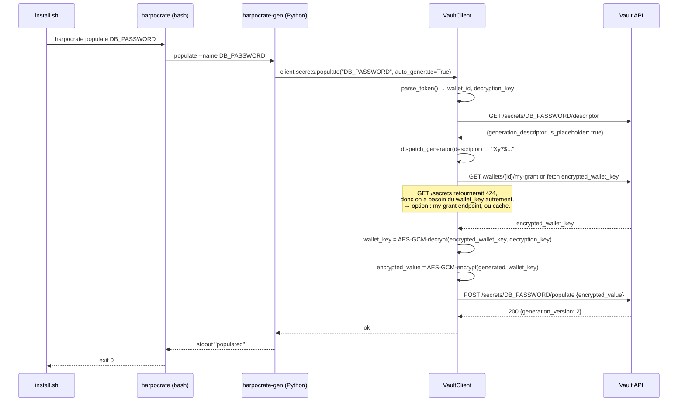

# Lot 09 — SDK Python + CLI Bash

> **Prérequis** : Lots 00-08.

## Objectif

Fournir les **bibliothèques clients** qui font la cryptographie côté client et permettent l'usage automatisé : un **SDK Python** (`harpocrate`) pour les agents et applications, un **CLI Bash** (`harpocrate`) pour les scripts d'installation type `install.sh` Swarm.

À la fin du lot, **`install.sh` peut consommer un wallet Harpocrate** au lieu du fichier `agflow-secrets.txt`. C'est le **jalon M2** (MVP automation complète).

## Dépendances

- Lots 00-08

## Périmètre

### Inclus

- Package Python `harpocrate` :
  - Client HTTP (`VaultClient`)
  - Modèles de données (`Wallet`, `Secret`, `Grant`)
  - Crypto E2E : Argon2id, AES-256-GCM, RSA-OAEP
  - 9 générateurs implémentés selon le catalogue du lot 06
  - Cache wallet_key en RAM (TTL configurable)
  - Authentification via API key (parsing du token, extraction de `decryption_key`)
  - Tests E2E avec un serveur de test
  - Packaging via `pyproject.toml`, publication TestPyPI à terme
- CLI Bash `harpocrate` :
  - Commands : `get`, `populate`, `populate-all`, `list`, `whoami`, `info`
  - Générateurs simples (random, uuid, bytes, passphrase, template) en bash pur
  - Générateurs cryptographiques délégués à un binaire Python embarqué (`harpocrate-gen`)
  - Compatibilité Linux (Ubuntu, Alpine via busybox)

### Exclus

- Pas de SDK JavaScript/TypeScript pour les autres langages (roadmap)
- Pas d'auth via JWT pour le SDK : API key uniquement (le SDK est pour les automates)
- Pas d'UI (lot 11)

## Spécifications fonctionnelles

### SDK Python — interface haut niveau

```python
from harpocrate import VaultClient

# Initialisation
client = VaultClient(
    token="hrp_1_xxx_yyy_05_zzz_www_hhhh",
    base_url="https://vault.yoops.org",
    wallet_key_cache_ttl=600,  # secondes
)

# Lecture d'un secret
value: str = client.secrets.get("ANTHROPIC_API_KEY")

# Lecture en bytes (pour les certificats binaires)
value_bytes: bytes = client.secrets.get_bytes("TLS_CERT")

# Listage
for secret_meta in client.secrets.list():
    print(secret_meta.name, secret_meta.is_placeholder)

# Populate un placeholder en générant localement
client.secrets.populate(
    name="DB_PASSWORD",
    auto_generate=True,  # utilise le generation_descriptor du serveur
)

# Populate tous les placeholders d'un coup
results = client.secrets.populate_all()
# → [PopulateResult(name="DB_PASSWORD", success=True), ...]

# Get-or-populate (lecture, ou génération si placeholder)
value = client.secrets.get_or_populate("DB_PASSWORD")

# Info sur l'API key elle-même
info = client.whoami()
# → ApiKeyInfo(wallet_id, permissions=["read", "init"], expires_at=...)
```

### Crypto interne du SDK

Tout le déchiffrement se passe dans le SDK :

```python
# Pseudo-code interne du SDK pour client.secrets.get(name):

def get(self, name: str) -> str:
    # 1. Récupérer le wallet_id et la decryption_key depuis le token
    decryption_key = self._token_info.decryption_key  # extrait à l'init

    # 2. Récupérer la wallet_key (cache ou serveur)
    if name in self._wallet_key_cache:
        wallet_key = self._wallet_key_cache[name]
    else:
        # GET /v1/wallets/{id}/secrets/{name}
        resp = self._http.get(f"/v1/wallets/{self.wallet_id}/secrets/{name}")
        encrypted_wallet_key = base64.b64decode(resp["encrypted_wallet_key"])
        # Le SDK déchiffre encrypted_wallet_key avec sa decryption_key
        wallet_key = aes_gcm_decrypt(encrypted_wallet_key, decryption_key)
        self._wallet_key_cache.set(name, wallet_key)

    # 3. Déchiffrer encrypted_value
    encrypted_value = base64.b64decode(resp["encrypted_value"])
    value = aes_gcm_decrypt(encrypted_value, wallet_key)

    return value.decode("utf-8")
```

### Implémentation des générateurs (côté SDK)

Pour `populate(auto_generate=True)`, le SDK :

1. GET le descripteur depuis `/v1/wallets/{id}/secrets/{name}/descriptor`
2. Génère localement la valeur selon le type
3. Chiffre avec wallet_key (AES-GCM)
4. POST `/v1/wallets/{id}/secrets/{name}/populate` avec `encrypted_value`

Implémentations :

```python
# harpocrate/generators/random.py
def generate_random(descriptor: dict) -> str:
    length = descriptor["length"]
    charset = _resolve_charset(descriptor["charset"])
    return "".join(secrets.choice(charset) for _ in range(length))

# harpocrate/generators/uuid_gen.py
def generate_uuid(descriptor: dict) -> str:
    version = descriptor.get("version", 4)
    if version == 4:
        return str(uuid.uuid4())
    elif version == 7:
        return str(_uuid7())  # custom impl

# harpocrate/generators/bytes_gen.py
def generate_bytes(descriptor: dict) -> str:
    raw = secrets.token_bytes(descriptor["length"])
    if descriptor["encoding"] == "base64url":
        return base64.urlsafe_b64encode(raw).rstrip(b"=").decode()
    elif descriptor["encoding"] == "hex":
        return raw.hex()

# harpocrate/generators/passphrase.py
def generate_passphrase(descriptor: dict) -> str:
    wordlist = load_wordlist(descriptor.get("language", "en"))
    words = [secrets.choice(wordlist) for _ in range(descriptor["words"])]
    return descriptor.get("separator", "-").join(words)

# harpocrate/generators/template.py
def generate_template(descriptor: dict) -> str:
    template = descriptor["template"]
    variables = descriptor["variables"]
    resolved = {}
    for var_name, var_descriptor in variables.items():
        if "literal" in var_descriptor:
            resolved[var_name] = var_descriptor["literal"]
        else:
            resolved[var_name] = dispatch_generator(var_descriptor)
    # Validation : tous les {placeholders} ont une valeur
    return template.format(**resolved)

# harpocrate/generators/rsa.py
def generate_rsa_keypair(descriptor: dict) -> str:
    """Retourne JSON {private, public}."""
    from cryptography.hazmat.primitives.asymmetric import rsa
    from cryptography.hazmat.primitives import serialization

    key = rsa.generate_private_key(
        public_exponent=65537,
        key_size=descriptor["key_size"],
    )
    fmt = descriptor.get("format", "pem")
    if fmt == "pem":
        priv = key.private_bytes(
            encoding=serialization.Encoding.PEM,
            format=serialization.PrivateFormat.PKCS8,
            encryption_algorithm=serialization.NoEncryption(),
        ).decode()
        pub = key.public_key().public_bytes(
            encoding=serialization.Encoding.PEM,
            format=serialization.PublicFormat.SubjectPublicKeyInfo,
        ).decode()
    elif fmt == "openssh":
        priv = key.private_bytes(
            encoding=serialization.Encoding.PEM,
            format=serialization.PrivateFormat.OpenSSH,
            encryption_algorithm=serialization.NoEncryption(),
        ).decode()
        pub = key.public_key().public_bytes(
            encoding=serialization.Encoding.OpenSSH,
            format=serialization.PublicFormat.OpenSSH,
        ).decode()
    return json.dumps({"private": priv, "public": pub})

# harpocrate/generators/ssh.py
def generate_ssh_keypair(descriptor: dict) -> str:
    """ed25519 ou rsa."""
    from cryptography.hazmat.primitives.asymmetric import ed25519
    if descriptor["algorithm"] == "ed25519":
        key = ed25519.Ed25519PrivateKey.generate()
        # ... format OpenSSH ...
    elif descriptor["algorithm"] == "rsa":
        return generate_rsa_keypair({"key_size": 4096, "format": "openssh"})

# harpocrate/generators/tls.py
def generate_tls_certificate(descriptor: dict) -> str:
    """Self-signed cert + private key, retourné en JSON."""
    from cryptography import x509
    from cryptography.x509.oid import NameOID
    from cryptography.hazmat.primitives import hashes

    key = rsa.generate_private_key(public_exponent=65537, key_size=descriptor["key_size"])
    subject = issuer = x509.Name([
        x509.NameAttribute(NameOID.COMMON_NAME, descriptor["common_name"]),
    ])
    san_list = [x509.DNSName(name) for name in descriptor.get("subject_alt_names", [])]
    cert = (
        x509.CertificateBuilder()
        .subject_name(subject)
        .issuer_name(issuer)
        .public_key(key.public_key())
        .serial_number(x509.random_serial_number())
        .not_valid_before(datetime.utcnow())
        .not_valid_after(datetime.utcnow() + timedelta(days=descriptor["validity_days"]))
        .add_extension(x509.SubjectAlternativeName(san_list), critical=False)
        .sign(key, hashes.SHA256())
    )
    cert_pem = cert.public_bytes(serialization.Encoding.PEM).decode()
    key_pem = key.private_bytes(
        encoding=serialization.Encoding.PEM,
        format=serialization.PrivateFormat.PKCS8,
        encryption_algorithm=serialization.NoEncryption(),
    ).decode()
    return json.dumps({"certificate": cert_pem, "private_key": key_pem})

# harpocrate/generators/bcrypt_pwd.py
def generate_bcrypt_password(descriptor: dict) -> str:
    import bcrypt
    plain = generate_random({"length": descriptor["length"], "charset": "alphanum"})
    hashed = bcrypt.hashpw(plain.encode(), bcrypt.gensalt(rounds=descriptor["rounds"])).decode()
    return json.dumps({"plain": plain, "hash": hashed})
```

### Structure du package Python

```
sdk-python/
├── harpocrate/
│   ├── __init__.py
│   ├── client.py                # VaultClient
│   ├── http.py                  # httpx wrapper avec retry
│   ├── token.py                 # parsing du token hrp_*
│   ├── crypto/
│   │   ├── __init__.py
│   │   ├── aes_gcm.py
│   │   ├── argon2.py
│   │   └── kdf.py
│   ├── generators/
│   │   ├── __init__.py          # dispatch table {type: fn}
│   │   ├── random.py
│   │   ├── uuid_gen.py
│   │   ├── bytes_gen.py
│   │   ├── passphrase.py
│   │   ├── template.py
│   │   ├── rsa.py
│   │   ├── ssh.py
│   │   ├── tls.py
│   │   ├── bcrypt_pwd.py
│   │   └── wordlists/
│   │       ├── en.txt           # EFF large wordlist
│   │       └── fr.txt
│   ├── models/
│   │   ├── wallet.py
│   │   ├── secret.py
│   │   └── auth.py
│   ├── cache.py                 # LRU + TTL pour wallet_key
│   ├── errors.py
│   └── _version.py
├── tests/
│   ├── unit/
│   ├── e2e/                     # serveur Vault de test via docker-compose
│   └── conftest.py
├── pyproject.toml
└── README.md
```

### `pyproject.toml`

```toml
[project]
name = "harpocrate"
version = "0.1.0"
requires-python = ">=3.10"
dependencies = [
    "httpx>=0.27",
    "cryptography>=42",
    "argon2-cffi>=23",
    "bcrypt>=4.1",
    "pydantic>=2.6",
]

[project.scripts]
harpocrate-gen = "harpocrate.cli:main"
```

### CLI Bash — `harpocrate`

Script bash qui appelle l'API en utilisant `curl` et `jq`, et délègue les opérations crypto à un helper Python (`harpocrate-gen`).

```bash
harpocrate [OPTIONS] COMMAND [ARGS...]

Options globales :
  --token <token>      Token API key (sinon HARPOCRATE_TOKEN env var)
  --url <url>          URL du serveur (sinon HARPOCRATE_URL env var)
  --json               Sortie JSON
  --quiet              Pas d'output sauf erreurs
  --help

Commandes :
  whoami               Affiche les infos de l'API key courante
  info                 Affiche les infos du wallet courant
  list [--placeholder|--valued]
                       Liste les secrets du wallet
  get <name>           Affiche la valeur d'un secret (stdout)
  populate <name>      Peuple un placeholder en générant localement
  populate-all         Peuple tous les placeholders
  get-or-populate <name>
                       Lit la valeur, ou génère et populate si placeholder
```

### Exemple d'usage CLI

```bash
export HARPOCRATE_TOKEN=hrp_1_xxx_yyy_05_zzz_www_hhhh
export HARPOCRATE_URL=https://vault.yoops.org

# Lister les secrets
harpocrate list
# → ANTHROPIC_API_KEY (valued)
# → DB_PASSWORD (placeholder)
# → TLS_CERT (placeholder)

# Populer tout en une commande
harpocrate populate-all
# → DB_PASSWORD: populated
# → TLS_CERT: populated

# Lire une valeur (stdout)
harpocrate get ANTHROPIC_API_KEY
# sk-ant-xxxxx
```

### Exemple d'intégration dans `install.sh`

```bash
#!/bin/bash
set -euo pipefail

# Setup Vault
export HARPOCRATE_TOKEN="${HARPOCRATE_TOKEN:?must be set}"
export HARPOCRATE_URL="${HARPOCRATE_URL:-https://vault.yoops.org}"

# 1. S'assurer que tous les secrets existent (génération auto si placeholder)
harpocrate populate-all

# 2. Pour chaque secret, le pousser dans Docker Swarm
for name in $(harpocrate list --json | jq -r '.[].name'); do
    value=$(harpocrate get "$name")
    # Supprimer l'ancien secret si existe (Swarm ne permet pas l'update direct)
    docker secret rm "$name" 2>/dev/null || true
    echo -n "$value" | docker secret create "$name" -
    echo "✓ $name pushed to Swarm"
done
```

### CLI — implémentation

```bash
#!/usr/bin/env bash
# /usr/local/bin/harpocrate

set -euo pipefail

VAULT_URL="${HARPOCRATE_URL:-${VAULT_URL:-}}"
VAULT_TOKEN="${HARPOCRATE_TOKEN:-${VAULT_TOKEN:-}}"

require() {
    [[ -n "$VAULT_TOKEN" ]] || { echo "ERROR: HARPOCRATE_TOKEN not set" >&2; exit 1; }
    [[ -n "$VAULT_URL" ]] || { echo "ERROR: HARPOCRATE_URL not set" >&2; exit 1; }
    command -v curl >/dev/null || { echo "ERROR: curl required" >&2; exit 1; }
    command -v jq >/dev/null || { echo "ERROR: jq required" >&2; exit 1; }
    command -v harpocrate-gen >/dev/null \
        || { echo "ERROR: harpocrate-gen (Python helper) required" >&2; exit 1; }
}

# Extraction du wallet_id et decryption_key depuis le token
parse_token() {
    IFS='_' read -ra PARTS <<< "$VAULT_TOKEN"
    [[ ${#PARTS[@]} -eq 8 ]] || { echo "ERROR: invalid token format" >&2; exit 1; }
    TOKEN_VERSION="${PARTS[1]}"
    TOKEN_ID="${PARTS[2]}"
    TOKEN_EXP="${PARTS[3]}"
    TOKEN_PERMS="${PARTS[4]}"
    TOKEN_AUTH="${PARTS[5]}"
    TOKEN_DKEY="${PARTS[6]}"
    TOKEN_HMAC="${PARTS[7]}"
}

cmd_list() {
    local wallet_id
    wallet_id=$(harpocrate-gen wallet-id-from-token "$VAULT_TOKEN")
    curl -fsS -H "Authorization: Bearer $VAULT_TOKEN" \
        "$VAULT_URL/v1/wallets/$wallet_id/secrets" | jq '.secrets'
}

cmd_get() {
    local name="$1"
    # Délègue au helper Python : il fait l'appel + déchiffrement
    harpocrate-gen get --token "$VAULT_TOKEN" --url "$VAULT_URL" --name "$name"
}

cmd_populate() {
    local name="$1"
    harpocrate-gen populate --token "$VAULT_TOKEN" --url "$VAULT_URL" --name "$name"
}

cmd_populate_all() {
    harpocrate-gen populate-all --token "$VAULT_TOKEN" --url "$VAULT_URL"
}

# ... etc

require
parse_token

case "${1:-}" in
    list) shift; cmd_list "$@" ;;
    get) shift; cmd_get "$@" ;;
    populate) shift; cmd_populate "$@" ;;
    populate-all) cmd_populate_all ;;
    whoami) cmd_whoami ;;
    info) cmd_info ;;
    *) echo "Usage: harpocrate {list|get|populate|populate-all|whoami|info}" >&2; exit 1 ;;
esac
```

**Décision architecturale : tout le travail crypto est dans le helper Python (`harpocrate-gen`).** Le bash sert d'orchestrateur fin et de wrapper d'options. Cela évite de réimplémenter AES-GCM, RSA, etc. en bash (cauchemar).

### Helper Python `harpocrate-gen`

Mince CLI Python qui réutilise le SDK :

```python
# harpocrate/cli.py
import click
from harpocrate import VaultClient

@click.group()
def main():
    pass

@main.command()
@click.option("--token")
@click.option("--url")
@click.option("--name")
def get(token, url, name):
    client = VaultClient(token=token, base_url=url)
    print(client.secrets.get(name), end="")

@main.command()
@click.option("--token")
@click.option("--url")
@click.option("--name")
def populate(token, url, name):
    client = VaultClient(token=token, base_url=url)
    client.secrets.populate(name, auto_generate=True)
    click.echo(f"{name}: populated")

# ... etc
```

## Spécifications techniques

### Cache wallet_key

Le SDK doit cacher la wallet_key déchiffrée pour éviter de la re-déchiffrer à chaque appel :

```python
# harpocrate/cache.py
from cachetools import TTLCache

class WalletKeyCache:
    def __init__(self, ttl_seconds: int = 600, maxsize: int = 16):
        self._cache = TTLCache(maxsize=maxsize, ttl=ttl_seconds)

    def get(self, wallet_id: str) -> bytes | None:
        return self._cache.get(wallet_id)

    def set(self, wallet_id: str, key: bytes) -> None:
        self._cache[wallet_id] = key

    def clear(self) -> None:
        self._cache.clear()
```

### Format AES-GCM utilisé

Convention dans `encrypted_value` et autres blobs : `nonce(12) || ciphertext || tag(16)`.

```python
# harpocrate/crypto/aes_gcm.py
import os
from cryptography.hazmat.primitives.ciphers.aead import AESGCM

def aes_gcm_encrypt(plaintext: bytes, key: bytes, aad: bytes = b"") -> bytes:
    aesgcm = AESGCM(key)
    nonce = os.urandom(12)
    ciphertext_with_tag = aesgcm.encrypt(nonce, plaintext, aad)
    return nonce + ciphertext_with_tag

def aes_gcm_decrypt(blob: bytes, key: bytes, aad: bytes = b"") -> bytes:
    if len(blob) < 12 + 16:
        raise ValueError("Invalid blob: too short")
    nonce, ct = blob[:12], blob[12:]
    aesgcm = AESGCM(key)
    return aesgcm.decrypt(nonce, ct, aad)
```

### Token parsing

```python
# harpocrate/token.py
import base64
import uuid
from dataclasses import dataclass

@dataclass(frozen=True)
class TokenInfo:
    version: str
    api_key_id: uuid.UUID
    expires_at: int  # 0 = no expiration
    permissions: int
    auth_secret_b64: str
    decryption_key: bytes
    hmac_b64: str

def parse_token(token: str) -> TokenInfo:
    if not token.startswith("hrp_"):
        raise ValueError("Not an Harpocrate token")
    parts = token.split("_")
    if len(parts) != 8:
        raise ValueError("Malformed token")
    _, v, id_b32, exp_b36, perms_hex, auth_b64, dkey_b64, hmac_b64 = parts

    id_bytes = base64.b32decode((id_b32 + "======").upper())
    api_key_id = uuid.UUID(bytes=id_bytes)
    exp = int(exp_b36, 36)
    perms = int(perms_hex, 16)

    dkey = base64.urlsafe_b64decode(dkey_b64 + "==")

    return TokenInfo(
        version=v, api_key_id=api_key_id, expires_at=exp, permissions=perms,
        auth_secret_b64=auth_b64, decryption_key=dkey, hmac_b64=hmac_b64,
    )
```

### Diagramme de flux : `populate` côté client



**Note sur le `my-grant` endpoint** : pour récupérer le `encrypted_wallet_key` quand on n'a pas encore lu un secret, il faut un endpoint dédié. Or pour les API keys, le `wallet_grants` correspondant est celui de l'owner. Donc on utilise `api_keys.encrypted_wallet_key` qui a été stockée à la création (chiffrée par `decryption_key`). 

Refinement : le serveur retourne `encrypted_wallet_key` (qui est `api_keys.encrypted_wallet_key` pour une API key) dans la réponse de `GET /v1/wallets/{id}` ou un nouvel endpoint `GET /v1/wallets/{id}/my-grant` (qui marche pour humain ET API key, en retournant le bon blob selon le type d'auth).

→ **À implémenter** : le `GET /my-grant` du lot 04 doit accepter aussi les API keys et retourner `api_keys.encrypted_wallet_key`. C'est une **extension du lot 04** à faire dans le lot 08, et que le SDK consomme.

## Critères de succès

1. ✅ `pip install harpocrate` (depuis le repo) installe le SDK et le helper
2. ✅ `harpocrate list` retourne les secrets du wallet
3. ✅ `harpocrate get NAME` affiche la valeur en clair sur stdout
4. ✅ `harpocrate populate NAME` génère et populate un placeholder
5. ✅ `harpocrate populate-all` traite tous les placeholders
6. ✅ Tous les 9 types de générateurs fonctionnent
7. ✅ Le déchiffrement E2E fonctionne (round-trip avec un secret créé via UI/curl)
8. ✅ Le cache wallet_key évite les déchiffrements répétés
9. ✅ Token parsing résiste aux tokens malformés (erreur claire)
10. ✅ Tests E2E : un script `install.sh` minimal fonctionne avec un Vault de test
11. ✅ Le helper Python est self-contained (pas de dépendance externe au bash CLI)
12. ✅ Documentation README claire pour l'usage

## Pièges connus

- **Le SDK doit absolument utiliser `secrets.token_bytes()` et `secrets.choice()`** pour la randomness, jamais `random.*`.
- **`getpass.getpass()` ne fonctionne pas en non-tty** : `harpocrate` doit fonctionner sans stdin interactif (cron, CI). Pas de prompt silencieux jamais.
- **Encoding stdout** : `client.secrets.get()` retourne `str`. Pour des bytes (certificats), proposer `get_bytes()` qui retourne directement `bytes`. Le CLI `get` doit gérer les deux : par défaut UTF-8, mais option `--binary` pour stdout bytes.
- **AES-GCM authenticity** : un `aes_gcm_decrypt()` qui échoue lève `cryptography.exceptions.InvalidTag`. C'est un signal de corruption ou clé incorrecte. Le SDK doit catcher et lever une erreur métier `VaultDecryptionError`.
- **`bcrypt_password` retourne JSON** : à documenter clairement. L'utilisateur attend potentiellement juste le hash. Convention : `{"plain": "...", "hash": "..."}`.
- **`tls_certificate` self-signed seulement** : ne PAS donner l'illusion qu'on peut signer avec une CA. Documenter clairement que les certs générés sont auto-signés et n'ont pas de chaîne de confiance.
- **wordlists** : embarquer la EFF large wordlist (7776 mots) pour `en` et une équivalent FR. Format : un mot par ligne, lowercase, ASCII strict.
- **Cache wallet_key et révocation** : si l'API key est révoquée, le cache continue à fonctionner localement jusqu'au TTL expiry. Acceptable au MVP. Pour une révocation immédiate, le serveur retournera 401 au prochain appel.
- **Compatibilité bash** : viser bash 4+. Pas de fonctionnalités bash 5 only.
- **Compatibilité Alpine (busybox)** : `read -r` et `IFS=` standard fonctionnent. Tester explicitement.
- **`harpocrate-gen` doit être dans le PATH** : à l'installation, vérifier que pip a bien installé l'entry point.
- **Dépendances système** : `curl` et `jq` requis pour le bash. Documenter, vérifier au démarrage.
- **Sécurité du token en logs** : le CLI doit JAMAIS écrire le token dans des logs. `set -x` sur bash → fuite. Filtrer ou désactiver explicitement.
- **HTTPS only** : refuser `http://` sauf si `HARPOCRATE_ALLOW_INSECURE=1` (pour dev local).

## Tests à écrire

### SDK Python — unitaires

- `test_token_parse_valid`
- `test_token_parse_malformed_raises`
- `test_aes_gcm_round_trip`
- `test_aes_gcm_wrong_key_raises_invalid_tag`
- `test_generator_random_charset_alphanum`
- `test_generator_random_charset_custom`
- `test_generator_uuid_v4_format`
- `test_generator_passphrase_words_count`
- `test_generator_template_resolves_variables`
- `test_generator_template_recursive_variable`
- `test_generator_rsa_keypair_pem`
- `test_generator_ssh_keypair_ed25519`
- `test_generator_tls_certificate_self_signed`
- `test_generator_bcrypt_password_returns_json`
- `test_wallet_key_cache_ttl`
- `test_wallet_key_cache_eviction`

### SDK Python — E2E (avec serveur de test)

- `test_e2e_get_secret`
- `test_e2e_populate_random`
- `test_e2e_populate_template`
- `test_e2e_populate_rsa_keypair`
- `test_e2e_populate_all`
- `test_e2e_revoked_key_returns_401`
- `test_e2e_get_or_populate_existing`
- `test_e2e_get_or_populate_placeholder`

### CLI Bash

- `test_cli_list_returns_secrets`
- `test_cli_get_returns_value`
- `test_cli_populate_works`
- `test_cli_populate_all_works`
- `test_cli_invalid_token_error`
- `test_cli_missing_env_vars_error`
- `test_cli_install_sh_integration` (le script `install.sh` complet doit passer)

## Ce qui suit

Le **lot 10** ajoute l'API d'audit log avec filtres et permissions différenciées. Le **lot 11** clôt le projet avec l'UI web pour les humains.
