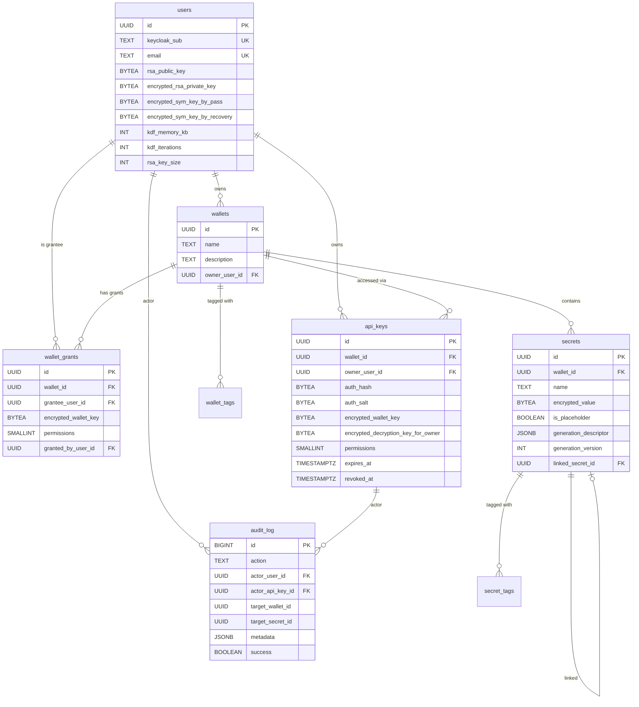

# Harpocrate — Document de cadrage

> **Lecture obligatoire avant tout lot.** Ce document fixe les décisions transverses, les conventions, et le vocabulaire partagé.

## 1. Vision produit

`Harpocrate` est un **gestionnaire de secrets E2E (end-to-end encrypted)** intégré à l'écosystème ag.flow. Il permet à des utilisateurs humains et à des automates (agents Docker, pipelines CI, scripts d'installation) de stocker, partager et consommer des secrets (API keys, mots de passe, certificats, clés SSH, etc.) avec une garantie cryptographique forte : **le serveur ne voit jamais les valeurs en clair**.

### Cas d'usage principaux

1. **Stockage de credentials d'agents ag.flow** : un agent Docker pull son `ANTHROPIC_API_KEY` au démarrage via une API key scopée à un wallet.
2. **Bootstrap d'environnement Swarm** : `install.sh` reçoit une API key, lit un wallet "template" préparé dans l'UI, génère localement les secrets manquants et les pousse dans Docker Swarm.
3. **Partage de secrets entre humains** : un développeur partage un wallet avec un collègue avec des permissions précises.
4. **Promotion entre environnements** : exporter la structure d'un wallet dev → uat → prod (sans valeurs).

### Ce que ce produit n'est pas

- Pas un PKI complet (pas de signing CA hiérarchique au MVP)
- Pas un gestionnaire d'identités (Keycloak fait ce job)
- Pas un secret manager d'infrastructure type Hashicorp Vault avec leasing dynamique, transit engine, etc.

## 2. Principes architecturaux

### Cinq principes non-négociables

1. **End-to-end encryption** : les valeurs des secrets ne sont jamais en clair côté serveur. Toute la cryptographie effective est faite par le client (UI navigateur ou SDK).
2. **Zero-knowledge admin** : un administrateur système avec accès à la base de données et aux logs ne peut pas lire les secrets.
3. **OIDC pour l'authentification, crypto pour le déchiffrement** : Keycloak gère l'identité, la passphrase utilisateur gère la capacité de déchiffrement. Les deux sont orthogonaux.
4. **Séparation stricte humain / machine** : les API keys (auth machine) ont un périmètre fonctionnel restreint. La gouvernance (création de wallets, gestion des grants, transferts) est réservée aux humains JWT.
5. **Pas de SQLAlchemy, pas d'Alembic** : asyncpg direct avec SQL en clair, migrations versionnées sous forme de fichiers `.sql` dans `migrations/`. Cohérent avec les standards ag.flow.

### Stack technique imposée

| Couche | Choix |
|---|---|
| Backend HTTP | FastAPI (Python 3.12+) |
| Validation | Pydantic v2 |
| DB | PostgreSQL 16+ |
| Driver DB | asyncpg (direct, pas d'ORM) |
| Logging | structlog en JSON |
| Auth | OIDC via Keycloak |
| Frontend | React + Mantine + ReactFlow + Zustand + Zod |
| Crypto navigateur | `window.crypto.subtle` + `argon2-browser` (WASM) |
| Crypto Python | `cryptography` (PyCA) + `argon2-cffi` |
| Containerisation | Docker, déploiement Swarm |
| Tunnel public | Cloudflare Tunnel (yoops.org) |

### Contraintes de code (standards ag.flow)

- **Aucun fichier > 300 lignes**. Si un fichier dépasse, le scinder.
- **TypeScript strict** côté frontend.
- **Type hints obligatoires** côté Python, validés par mypy en strict mode.
- **structlog JSON** : pas de print, pas de logging.basicConfig en prod.
- **Aucune valeur sensible loggée** : ni passphrases, ni secrets en clair, ni tokens, ni body des endpoints `/secrets`.

## 3. Modèle cryptographique

### Vue d'ensemble

```
PASSPHRASE UTILISATEUR (humain, jamais transmise)
    │
    │ Argon2id(passphrase, salt_pass)
    ▼
PASS_KEY (256 bits, en RAM client uniquement)
    │
    │ AES-256-GCM(rsa_priv, pass_key) → blob serveur
    │ AES-256-GCM(sym_key, pass_key) → blob serveur
    ▼
RSA_PRIV + SYM_KEY (déchiffrées en RAM client à l'unlock)

WALLET_KEY (256 bits, par wallet, générée côté client)
    │
    │ RSA-OAEP(wallet_key, rsa_pub_user) → wallet_grants.encrypted_wallet_key
    ▼
DESTINATAIRES (chaque grantee a sa copie chiffrée)

SECRET_VALUE (texte clair côté client uniquement)
    │
    │ AES-256-GCM(value, wallet_key) → secrets.encrypted_value
    ▼
VALEUR CHIFFRÉE EN BASE
```

### Recovery

```
SEED RECOVERY (32 bytes random, encodés BIP-39 24 mots, donnés à l'humain)
    │
    │ Argon2id(seed, salt_recovery)
    ▼
RECOVERY_KEY
    │
    │ AES-256-GCM(sym_key, recovery_key) → blob serveur
    ▼
SYM_KEY (récupérable si la passphrase est perdue)
```

### API keys (vrai E2E machine)

```
TOKEN: hrpv_<v>_<id>_<exp>_<perms>_<auth_secret>_<decryption_key>_<hmac>
                                       │             │
                                       │             └── jamais envoyé serveur, RAM SDK
                                       └── envoyé serveur (vérification Argon2id)

WALLET_KEY chiffrée par decryption_key → api_keys.encrypted_wallet_key
                       │
                       │ Le serveur ne possède PAS decryption_key,
                       │ donc ne peut pas déchiffrer encrypted_wallet_key.
                       ▼
SDK CLIENT déchiffre wallet_key, puis encrypted_value
```

### Paramètres cryptographiques (floors)

| Paramètre | Floor (min) | Défaut | Configurable |
|---|---|---|---|
| Argon2id memory | 65536 KB (64 MB) | 65536 | ↑ uniquement |
| Argon2id iterations | 3 | 3 | ↑ uniquement |
| Argon2id parallelism | 4 | 4 | ↑ uniquement |
| RSA key size | 2048 | 2048 | 2048 ou 4096 |
| Passphrase length | 12 | 12 | ↑ uniquement |
| Recovery words (BIP-39) | 24 | 24 | 12 ou 24 |
| Salt size | 16 bytes | 16 | fixe |

Le serveur **rejette au démarrage** toute config qui descend en dessous des floors.

### Algorithmes utilisés

| Usage | Algorithme |
|---|---|
| KDF passphrase / recovery | **Argon2id** (RFC 9106) |
| Chiffrement symétrique | **AES-256-GCM** (NIST SP 800-38D) |
| Chiffrement asymétrique | **RSA-2048/4096 OAEP** avec SHA-256 (PKCS#1 v2.2) |
| HMAC tokens API key | **HMAC-SHA256** tronqué à 128 bits |
| Hash mot de passe API key | **Argon2id** (mêmes floors) |
| Encodage tokens | **base64url** (URL-safe, sans padding) |
| Recovery phrase | **BIP-39** 24 mots (256 bits d'entropie) |

### Le serveur ne voit JAMAIS

- Passphrase utilisateur
- Recovery seed / mots BIP-39
- Pass_key, recovery_key, sym_key, rsa_priv (versions en clair)
- Wallet_key (en clair)
- Valeur en clair d'un secret
- Decryption_key d'API key (jamais transmise par le SDK)

### Le serveur voit en clair

- Email, display_name, keycloak_sub
- RSA pub key utilisateur (publique par nature)
- Nom et description des wallets
- Nom, description, tags des secrets
- Generation_descriptor des secrets
- Auth_secret d'API key (à la création, mais stocké hashé)
- HMAC key serveur (env var)
- Audit logs

## 4. Modèle de permissions

### 6 permissions sur 6 bits (bitmap)

| Bit | Permission | Valeur | Effet précis |
|---|---|---|---|
| 0 | `read` | 0x01 | Lire et déchiffrer la valeur d'un secret existant |
| 1 | `add` | 0x02 | Créer un nouveau secret (échoue si nom existe déjà) |
| 2 | `init` | 0x04 | Remplir un placeholder (échoue si déjà valorisé) |
| 3 | `write` | 0x08 | Modifier la valeur d'un secret valorisé (échoue si placeholder) |
| 4 | `remove` | 0x10 | Supprimer un secret |
| 5 | `share` | 0x20 | Créer/révoquer des grants, créer des API keys |

Plage : 0 à 63 (`0x3F`). Stocké en `SMALLINT`. Owner = 63.

### Règles d'application

- Permissions composables : un grant possède une **liste** de permissions, pas un niveau.
- Cumul d'exigences : pour `populate` un placeholder, il faut **`[init]`** (pas `[write]`). Pour modifier une valeur existante, il faut **`[write]`** (pas `[init]`). **Strictement disjoints.**
- L'**owner d'un wallet est immuable** : son grant ne peut pas être modifié ou supprimé via l'API `[share]`. Seul un transfert de propriété change l'owner. Trigger DB de défense en profondeur.
- Permissions d'une API key ⊆ permissions de son owner sur le wallet. Vérifié à la création **et** à chaque requête (cascade).

### Cas d'usage des combinaisons

| Combinaison | Cas d'usage |
|---|---|
| `[read]` | Agent qui consomme |
| `[init]` | install.sh qui peuple un wallet template |
| `[init, read]` | install.sh qui doit aussi relire des valeurs déjà set |
| `[add]` | Pipeline CI qui injecte de nouveaux secrets sans pouvoir lire |
| `[read, write]` | Admin opérationnel (rotation) |
| `[read, add, init, write, remove]` | Power user sans gouvernance |
| `0x3F` (63) | Owner |

## 5. Modèle de données — vue ER



Voir `LOT_01_DATABASE_SCHEMA.md` pour le DDL complet.

## 6. Surface API — séparation JWT / API Key

| Endpoint | JWT | API Key |
|---|:---:|:---:|
| `GET /v1/me`, `/me/bootstrap`, `/me/crypto`, `/me/passphrase`, `/me/recovery` | ✅ | ❌ |
| `POST /v1/wallets`, `DELETE /wallets/{id}`, `PATCH /wallets/{id}` | ✅ | ❌ |
| `POST /v1/wallets/{id}/transfer-ownership` | ✅ | ❌ |
| `GET /v1/wallets/{id}/export`, `POST /v1/wallets/import` | ✅ | ❌ |
| `GET /v1/wallets/{id}/grants`, POST/PATCH/DELETE | ✅ | ❌ |
| `GET /v1/users/lookup` | ✅ | ❌ |
| `GET /v1/wallets`, `GET /v1/wallets/{id}` | ✅ | ⚠️ scopé |
| `GET /v1/wallets/{id}/secrets` (liste) | ✅ | ✅ |
| `GET /secrets/{name}`, `GET /secrets/{name}/descriptor` | ✅ | ✅ |
| `POST /secrets`, `POST /secrets/placeholder`, `POST /secrets/{name}/populate` | ✅ | ✅ |
| `PUT /secrets/{name}`, `PATCH /secrets/{name}`, `DELETE /secrets/{name}` | ✅ | ✅ |
| `GET /v1/wallets/{id}/api-keys`, `POST`, `PATCH`, `DELETE` | ✅ | ❌ |
| `GET /v1/audit-log` | ✅ | ⚠️ propres actions seulement |
| `GET /v1/health`, `/v1/config/public`, `/v1/config/keycloak` | 🌐 | 🌐 |

**Endpoints accessibles aux API keys = 12 sur 36.**

## 7. Format de token API key

```
hrpv_<version>_<api_key_id>_<exp>_<perms>_<auth_secret>_<decryption_key>_<hmac>
```

| Champ | Format | Taille | Rôle |
|---|---|---|---|
| `agv` | littéral | 3 | Préfixe (détectable par scanners de fuites) |
| `version` | char | 1 | "1" — permet rotation HMAC key plus tard |
| `api_key_id` | UUID base32 sans tirets | 26 | Lookup DB |
| `exp` | timestamp Unix base36 | ~7 | Expiration auto-vérifiable |
| `perms` | hex 1 octet | 2 | Permissions encodées (0x00..0x3F) |
| `auth_secret` | base64url 32 bytes | 43 | Vérifié Argon2id en DB |
| `decryption_key` | base64url 32 bytes | 43 | **Jamais envoyée au serveur**, gardée par SDK |
| `hmac` | base64url 16 bytes | 22 | HMAC-SHA256 tronqué sur les champs publics |

**Total : ~155 chars.** Séparateur `_`.

### Calcul du HMAC

```
message = f"{version}_{id}_{exp}_{perms}_{auth_secret}"
hmac = HMAC-SHA256(master_hmac_key_server, message)[:16]
```

`decryption_key` n'est PAS dans le HMAC : le serveur n'a pas besoin de la valider, il ne la voit jamais.

### Validation à la requête (ordre)

1. Parse format → 401 si malformé (0 DB)
2. Vérif `exp > now()` → 401 si expiré (0 DB)
3. Recalcul HMAC + constant-time compare → 401 si invalide (0 DB)
4. Vérif `perms` contient la permission requise → 403 (0 DB)
5. Lookup DB par `api_key_id`, vérif `revoked_at IS NULL`, vérif Argon2id(`auth_secret`) == `auth_hash`
6. Vérif owner a toujours un grant valide sur le wallet (cascade Option 2)

Les 4 premiers checks sont **0-DB** : protège contre attaques de masse.

### Mise en cache

- Validation Argon2id : cache (api_key_id → True/False) avec TTL 60s
- Wallet_key déchiffrée : cache (wallet_id → wallet_key) avec TTL 5-10 min, configurable

## 8. Catalogue des générateurs

### MVP (lot 06 et lot 09)

| Type | Schéma JSON | SDK Python | CLI Bash |
|---|---|---|---|
| `random` | `{type, length, charset}` | ✅ | ✅ |
| `uuid` | `{type, version}` | ✅ | ✅ |
| `bytes` | `{type, length, encoding}` | ✅ | ✅ |
| `passphrase` | `{type, words, separator, language}` | ✅ | ✅ |
| `template` | `{type, template, variables}` | ✅ | ✅ |
| `rsa_keypair` | `{type, key_size, format}` | ✅ | ⚠️ via Python embarqué |
| `ssh_keypair` | `{type, algorithm}` | ✅ | ⚠️ via Python embarqué |
| `tls_certificate` | `{type, common_name, sans, validity_days, key_size, self_signed}` | ✅ | ⚠️ via Python embarqué |
| `bcrypt_password` | `{type, length, rounds}` | ✅ | ⚠️ via Python embarqué |

### Pas dans le MVP (roadmap)

- PKI hiérarchique (CA signing)
- TOTP secrets
- JWT keypairs (RS256, ES256)
- GPG keypairs
- Plugins user-defined

### Charset values pour `random`

`alphanum`, `alpha`, `numeric`, `hex`, `base64url`, `printable_ascii`, ou custom string.

### Manuel

Un secret sans `generation_descriptor` (NULL) est saisi manuellement. Pas de type "manual" dans le catalogue, juste l'absence de descripteur.

## 9. Roadmap post-MVP

- **HSM/TPM/KMS** : la `master_hmac_key_server` doit à terme ne jamais exister en clair. Options : TPM 2.0 (PKCS#11), YubiHSM 2, Cloud KMS, HashiCorp Vault Transit Engine.
- **Synchronisation multi-environnements** : templates wallet, attribut `environment`, lien `wallet_lineage`, endpoint `/diff`, auto-promotion avec approvals.
- **Transfert de propriété avec acceptation** : workflow propose/accept en 2 étapes.
- **Permission `export` dédiée** : permettre l'export aux API keys avec permission spécifique.
- **Permission `regenerate` distincte** : actuellement intégrée à `[write]`, à scinder si besoin.
- **Politique de rotation automatique** : `rotation_policy: { interval_days: 90, notify_before_days: 7 }`.
- **Format `version=2` du token API key** : rotation de la `master_hmac_key_server`.
- **Fédération inter-instances** : sync structures entre `dev.vault.yoops.org` et `prod.vault.yoops.org`.
- **Permissions par secret** (pas seulement par wallet) : granularité fine.
- **Recovery phrase Shamir Secret Sharing** : split en N parts, M requis pour recover.

## 10. Glossaire

| Terme | Définition |
|---|---|
| **Wallet** | Coffre logique contenant un ensemble de secrets, possédant une `wallet_key` unique |
| **Secret** | Couple (nom, valeur) chiffré dans un wallet |
| **Grant** | Lien entre un user et un wallet, contient l'`encrypted_wallet_key` chiffrée pour ce user |
| **Owner** | Créateur du wallet, immuable sauf transfert |
| **Placeholder** | Secret avec descripteur de génération mais sans valeur (état initial avant `populate`) |
| **API key** | Token machine pour automates, format `hrpv_*`, scopé à un wallet |
| **Generation descriptor** | JSON décrivant comment générer la valeur d'un secret |
| **Pass_key** | Clé dérivée de la passphrase via Argon2id, n'existe qu'en RAM client |
| **Sym_key** | Clé symétrique de l'utilisateur, chiffrée par pass_key et par recovery_key |
| **Wallet_key** | Clé symétrique du wallet, chiffrée par RSA pub user (grants) ou par decryption_key (API keys) |
| **Decryption_key** | Clé symétrique propre à une API key, présente UNIQUEMENT dans le token, jamais en DB |
| **Master_hmac_key_server** | Clé HMAC du serveur, en env var, signe les tokens API key |
| **Recovery seed / phrase** | 32 bytes random encodés BIP-39 24 mots, donnés à l'humain pour récupération |
| **Floor** | Valeur minimale d'un paramètre, jamais descendable, validée au démarrage |

## 11. Roadmap — résumé des 11 lots

```mermaid
gantt
    title Harpocrate — Découpage en lots
    dateFormat X
    axisFormat %s
    section Backend
    Lot 00 — Fondations          :l00, 0, 1
    Lot 01 — Schéma DB           :l01, after l00, 1
    Lot 02 — Auth + bootstrap    :l02, after l01, 1
    Lot 03 — Wallets CRUD        :l03, after l02, 1
    Lot 04 — Grants              :l04, after l03, 1
    Lot 05 — Secrets CRUD        :l05, after l03, 1
    Lot 06 — Placeholders + gen  :l06, after l05, 1
    Lot 07 — Export / Import     :l07, after l06, 1
    Lot 08 — API keys            :l08, after l04, 1
    Lot 10 — Audit log API       :l10, after l08, 1
    section Clients
    Lot 09 — SDK Python + CLI    :l09, after l08, 1
    Lot 11 — UI Web              :l11, after l09, 2
```



### Jalons

- **M1 (fin lot 07)** : MVP backend humain — créer/partager/peupler des wallets via curl
- **M2 (fin lot 09)** : MVP automation complète — `install.sh` fonctionne, SDK + CLI livrés
- **M3 (fin lot 11)** : MVP user-facing complet — UI web utilisable

## 12. Conventions de nommage et structure projet

### Structure générale du repo

```
harpocrate/
├── backend/
│   ├── app/
│   │   ├── api/              # Routes FastAPI par domaine
│   │   ├── core/             # Config, security, dependencies
│   │   ├── crypto/           # Utilitaires crypto serveur (HMAC, validation)
│   │   ├── db/               # Pool asyncpg, requêtes SQL
│   │   ├── models/           # Pydantic schemas
│   │   ├── services/         # Logique métier
│   │   └── main.py
│   ├── migrations/           # *.sql versionnés
│   ├── tests/
│   ├── pyproject.toml
│   └── Dockerfile
├── sdk-python/
│   ├── harpocrate/
│   │   ├── client.py
│   │   ├── crypto/
│   │   ├── generators/
│   │   └── models/
│   ├── tests/
│   └── pyproject.toml
├── cli-bash/
│   ├── harpocrate           # script principal
│   ├── lib/
│   └── tests/
├── frontend/
│   ├── src/
│   │   ├── components/
│   │   ├── crypto/
│   │   ├── pages/
│   │   └── stores/
│   └── package.json
├── docs/                     # Tous les LOT_*.md sont ici
├── docker-compose.yml
└── README.md
```

### Conventions Python

- snake_case pour modules, fonctions, variables
- PascalCase pour classes
- SCREAMING_CASE pour constantes
- `_private` pour attributs privés
- Type hints obligatoires
- Docstrings Google style
- Imports : stdlib, then third-party, then local (séparés par lignes vides)

### Conventions SQL

- snake_case pour tables et colonnes
- Pluriel pour les tables (`users`, `wallets`)
- FK : `<other_table_singular>_id` (ex: `wallet_id`, `owner_user_id`)
- Index : `idx_<table>_<columns>`
- Triggers : `trg_<purpose>`
- Migrations : `NNN_descriptive_name.sql` (NNN = ordre)

### Conventions API

- URLs en kebab-case (`/api-keys`, `/transfer-ownership`)
- Versionning : préfixe `/v1/`
- Pagination cursor-based (jamais offset)
- Codes d'erreur métier : enum string en `error` (ex: `"placeholder_expected"`)
- Format date : ISO 8601 UTC

### Variables d'environnement (préfixe `HARPOCRATE_`)

| Variable | Type | Obligatoire | Défaut |
|---|---|:---:|---|
| `HARPOCRATE_DB_DSN` | string | ✅ | — |
| `HARPOCRATE_KEYCLOAK_REALM` | string | ✅ | — |
| `HARPOCRATE_KEYCLOAK_URL` | URL | ✅ | — |
| `HARPOCRATE_KEYCLOAK_CLIENT_ID` | string | ✅ | — |
| `HARPOCRATE_HMAC_KEY` | base64 32 bytes | ✅ | — |
| `HARPOCRATE_KDF_MEMORY_KB` | int | ❌ | 65536 |
| `HARPOCRATE_KDF_ITERATIONS` | int | ❌ | 3 |
| `HARPOCRATE_KDF_PARALLELISM` | int | ❌ | 4 |
| `HARPOCRATE_RSA_KEY_SIZE_MIN` | int | ❌ | 2048 |
| `HARPOCRATE_PASSPHRASE_LENGTH_MIN` | int | ❌ | 12 |
| `HARPOCRATE_AUDIT_RETENTION_DAYS` | int | ❌ | 90 |
| `HARPOCRATE_WALLET_KEY_CACHE_TTL_SECONDS` | int | ❌ | 600 |
| `HARPOCRATE_API_KEY_VALIDATION_CACHE_TTL_SECONDS` | int | ❌ | 60 |
| `HARPOCRATE_LOG_LEVEL` | enum | ❌ | INFO |
| `HARPOCRATE_PUBLIC_URL` | URL | ✅ | — |

## 13. Tests

- Backend : pytest + pytest-asyncio + httpx (TestClient FastAPI)
- DB de test : container Postgres dédié, schéma rejoué à chaque session
- Crypto : tests vectoriels (entrées fixes → sorties fixes) pour valider les implémentations
- Couverture cible : 80% minimum, 100% sur les modules crypto
- Tests E2E : un Keycloak de test orchestré via docker-compose dans `tests/e2e/`

## 14. Sécurité — checklist transverse

À chaque endpoint, vérifier :

- [ ] Auth requise (JWT, API key, ou aucune si endpoint public)
- [ ] Type d'auth approprié (humain seulement, ou mixte)
- [ ] Permission requise déclarée et vérifiée
- [ ] Validation Pydantic stricte du body
- [ ] Pas de log du body sur les endpoints `/secrets`
- [ ] Audit log avec metadata pertinente, success/error
- [ ] Codes d'erreur métier (pas juste 400 générique)
- [ ] TLS obligatoire (assuré par Cloudflare Tunnel en prod)
- [ ] Rate limiting si endpoint exposé à abus (lookup, login)
- [ ] Pas de fuite d'info dans les erreurs (timing attacks, énumération)

À chaque opération crypto :

- [ ] Constant-time compare pour comparaisons de hashes
- [ ] Zero-out des bytearray sensibles après usage (best-effort en Python)
- [ ] Aucune valeur sensible loggée
- [ ] AES-GCM avec nonce unique (jamais réutilisé)
- [ ] Validation du tag d'authentification AES-GCM (échec si mauvaise clé)
- [ ] Argon2id avec params validés au démarrage

## 15. Comment lire les documents de lot

Chaque `LOT_NN_NAME.md` suit la même structure :

1. **Objectif** : ce que le lot livre, en une phrase
2. **Dépendances** : lots prérequis
3. **Périmètre** : ce qui est dans le lot, ce qui n'y est pas
4. **Spécifications fonctionnelles** : endpoints, comportements, schémas
5. **Spécifications techniques** : structure de fichiers, contraintes
6. **Critères de succès** : tests à valider pour considérer le lot fini
7. **Exemples** : code, requêtes, réponses
8. **Pièges connus** : erreurs classiques à éviter

Bonne implémentation.
